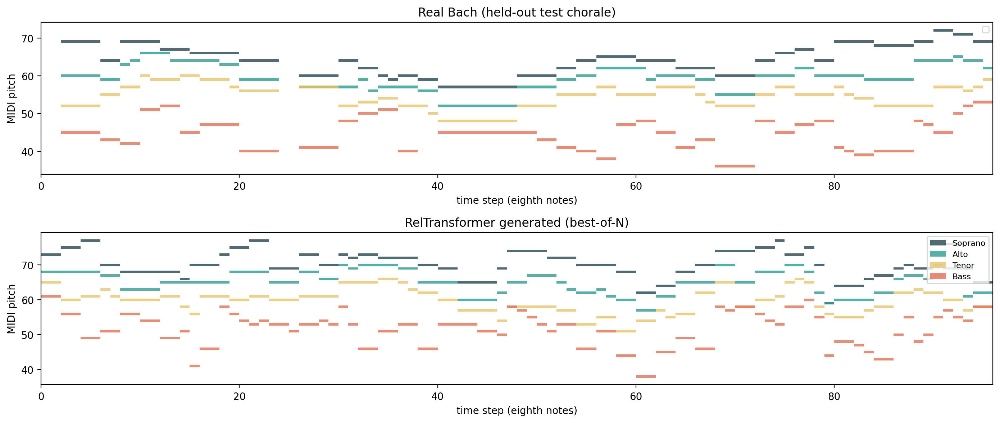

# Symbolic Music Transformers

**Generate four-voice music, or harmonize a given soprano melody.**

An independently completed project by **Ashley Liu (Xinying Liu)**, combining two Transformer architectures, Bach chorale preprocessing, sampling controls, musical diagnostics, and inspectable historical experiment outputs.

| Task | Model | Output |
|---|---|---|
| Unconditional generation | Decoder-only Transformer with learned relative-position bias and beat-position embeddings | Soprano/alto/tenor/bass chord sequences |
| Melody-conditioned harmonization | Bidirectional melody encoder + autoregressive harmony decoder | Alto/tenor/bass conditioned on a supplied soprano |

## Listen first

Open **[the local listening page](examples/listen.html)** after downloading the repository. GitHub may show HTML as source rather than execute it; the WAV links below can be downloaded directly.

- [Unconditional sample — WAV](examples/audio/symbolic_unconditioned.wav) · [original MIDI](examples/symbolic_unconditioned.mid)
- [Conditioned sample — WAV](examples/audio/symbolic_conditioned.wav) · [original MIDI](examples/symbolic_conditioned.mid)

The MIDIs are preserved local project artifacts. WAV files were newly synthesized from those MIDIs using simple tones for convenient listening; they are not a new neural-model run or recordings of real instruments. The conditioned sample contains the supplied soprano alongside generated lower voices.



*Historical notebook figure. Its generated sequence precedes a later reranking step, so it need not depict the final downloadable MIDI.*

## Run an offline artifact check

Python 3.10+; no GPU, API key, dataset download, or third-party package needed:

```bash
python scripts/audit_history.py
python scripts/preview_samples.py
python -m unittest discover -s tests -v
```

These commands check saved-output consistency, MIDI timing/structure, and artifact provenance. PyTorch architecture tests are explicitly skipped if PyTorch is absent. They do not regenerate historical predictions.

## Historical evidence

The selected notebook contains a saved 30-epoch GPU run with 220 chorales: 176 source chorales expanded to 880 training sequences and 44 evaluation chorales. The split occurs before transposition augmentation. Original checkpoint files and per-token prediction logs were not found in the selected project folders.

| Recorded quantity | Value | Interpretation |
|---|---:|---|
| Harmonizer final logged token accuracy | **31.752%** | Teacher-forced prediction on the monitored evaluation split |
| Lookup displayed token accuracy | **5.3%** | Rounded historical baseline; scoring masks differ from the Transformer |
| Harmonizer final logged perplexity | 58.200 | Predictive loss metric, not a listening-quality score |
| Unconditional LM final logged perplexity | 485.770 | Historical notebook output, not a fresh reproduction |

The original code observes the split named `test` during training. It should be described as a **monitored held-out split**, not an untouched final test. Differences in unknown-token and short-window handling also limit the baseline comparison. See [evaluation notes](docs/EVALUATION.md) before quoting a performance improvement.

**Result source:** [machine-readable summary](results/historical/summary.json), [preserved notebook](results/historical/source_notebook.ipynb), and [version-selection record](docs/VERSION_SELECTION.md). Cleared execution counters do not mean the notebook has no saved outputs; they also do not prove a clean, reproducible execution order.

## Train and generate a new run

The [clean notebook](notebooks/music_generation.ipynb) has no saved outputs. Model classes are shared with `musicgen/models.py`; a notebook-derived script retains the sequential preprocessing, training, evaluation and generation stages.

```bash
python -m pip install -r requirements.txt
python scripts/run_experiment.py --profile smoke --device cpu --out outputs/smoke
```

A larger configuration is explicit:

```bash
python scripts/run_experiment.py --profile full --device cuda --out outputs/full
```

New runs save figures, split IDs, dependency versions, training/evaluation summaries, both model checkpoints, and generated MIDI. The output directory must be empty to prevent mixing runs. `--epochs` overrides the training duration; `--seed` sets the seed. A syntax/dependency preflight makes no training calls:

```bash
python scripts/run_experiment.py --check-only
```

**Validation boundary:** training and inference were not rerun during this packaging pass because the available runtime lacks PyTorch, music21, SciPy and Matplotlib. Full-pipeline behavior remains to be validated in a configured environment. Dependency ranges are not a recovered historical lockfile. See [reproduction instructions](docs/REPRODUCING.md).

## What is implemented

- Eighth-note SATB grids, key normalization, train-only transposition augmentation, and separate chord/melody/harmony vocabularies.
- A causal Transformer LM with weight tying, relative-position bias, and periodic beat embeddings.
- A sequence-to-sequence harmonizer whose encoder can see the full provided melody while its harmony decoder is causal.
- Top-k/top-p-style sampling, heuristic music-theory preferences, best-of-N reranking, and beam-search experiments.
- Unigram, bigram, lookup and untrained baselines; diagnostics for repetition, pitch distribution, consonance, voice crossing, and n-gram overlap.

The inherited sampler and musical diagnostics are research heuristics, not guarantees of music-theory correctness. No claim of state-of-the-art performance or absence of memorization is made.

## Repository map

```text
musicgen/models.py        Shared neural architectures
musicgen/history.py       Read historical notebook outputs without executing them
musicgen/midi.py          MIDI inspection and simple WAV synthesis
notebooks/               Clean notebook for new runs
research/experiment.py   Import-safe notebook-derived experiment
scripts/                 Training runner, artifact audit and sample preview
results/historical/      Preserved source notebook and extracted summary
examples/                Original MIDI, new WAV previews, saved figures
tests/                   Artifact integrity and optional architecture tests
docs/                    Technical report, provenance, evaluation and validation
```

## Report and attribution

- [Technical report](docs/REPORT.md)
- [Evaluation limitations](docs/EVALUATION.md)
- [Local validation](docs/VALIDATION.md)
- [Attribution and packaging changes](docs/ATTRIBUTION.md)

The author confirmed independent completion. Third-party libraries, the music21 corpus, course materials and referenced research retain their own terms. This candidate does not assign a new blanket license. Raw dataset files, unrelated coursework, original presentation assets, and duplicate FINAL notebooks are not bundled.
